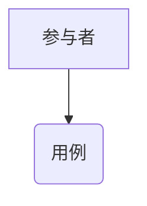
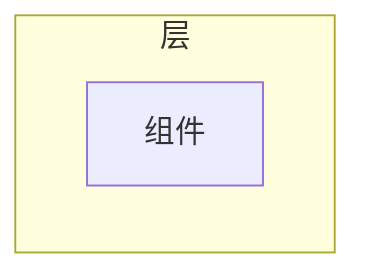
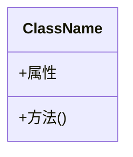
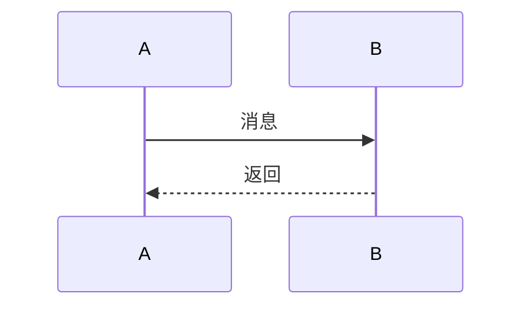
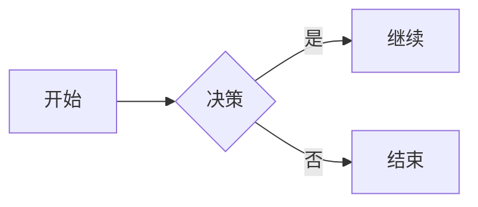

# UML图表驱动代码生成系统 - 完整指南

## 🎯 核心理念

> **传统方式存在重大缺陷：自然语言→代码的直接生成容易产生理解偏差**
> 
> **解决方案：通过UML图表作为中间验证点，每一步都可修正，显著降低代码偏差**

## 📚 文档导航

### 快速开始
- 📖 [快速开始指南](./UML图表驱动快速开始指南.md) - 5分钟上手
- 🎓 [详细功能说明](./UML图表驱动代码生成说明.md) - 完整功能介绍
- 📋 [系统更新日志](./系统更新日志_2024-11-08.md) - 了解新功能

### 技术文档
- 🔧 [审阅系统说明](./审阅系统功能说明.md) - 评审和日志功能
- 🏗️ [项目结构说明](./项目结构说明.md) - 整体架构
- 🚀 [启动说明](./启动说明.md) - 部署指南

## 🌟 核心功能

### 1. 五大专业模块

```
┌─────────────────────────────────────┐
│  项目需求                            │
│  └─ 📑 开发流程文档                  │
│      ├─ 📝 详细需求描述              │
│      ├─ 🏗️ 架构设计                 │
│      ├─ 💻 详细设计                  │
│      ├─ 🔗 需求→架构追溯             │
│      └─ 🔗 需求→设计追溯             │
└─────────────────────────────────────┘
```

### 2. UML图表支持

| 模块 | 图表类型 | 用途 |
|------|---------|------|
| 详细需求描述 | 用例图 | 识别参与者和用例 |
| 架构设计 | 组件图 | 展示系统组件和依赖 |
| 详细设计 | 类图 | 定义类结构和关系 |
| 需求→架构追溯 | 流程图 | 展示流程和决策点 |
| 需求→设计追溯 | 序列图 | 展示交互顺序 |

### 3. 渐进式代码生成

```
传统方式（❌ 高偏差）:
需求 ──────> 代码
     ^
     容易理解偏差

UML驱动（✅ 低偏差）:
需求 → 用例图 → 组件图 → 类图 → 代码
      ↓验证   ↓验证   ↓验证  ↓准确
   每一步都可修正！偏差降低90%！
```

## 🚀 快速开始

### 方法1：手动操作（推荐学习）

```bash
# 1. 启动服务
cd web
python start_server.py

# 2. 打开浏览器
http://localhost:5000

# 3. 操作步骤
- 填写"详细需求描述" → 点击"生成用例图"
- 填写"架构设计" → 点击"生成组件图"  
- 填写"详细设计" → 点击"生成类图"
- 点击"基于图表生成代码" → 获得高质量代码！
```

### 方法2：完整工作流（推荐生产）

```bash
# 1. 填写所有模块的文本内容
# 2. 点击右侧导航的"完整工作流"按钮
# 3. 系统自动执行所有步骤
# 4. 获得完整的图表和代码！
```

### 方法3：使用演示脚本

```bash
# 查看演示数据和工作流程
python scripts/demo_uml_workflow.py
```

## 📊 功能清单

### 每个模块包含：
- ✅ 文本输入区域
- ✅ UML图表编辑器（Mermaid）
- ✅ 实时图表预览
- ✅ AI自动生成图表
- ✅ 基于图表生成代码
- ✅ LLM智能评阅
- ✅ 专家人工评阅
- ✅ 文档上传/下载
- ✅ 版本历史管理
- ✅ 图表保存/导出

### 右侧导航功能：
- 🧭 智能导航（快速跳转）
- 🔍 搜索功能
- ⚡ 快速操作
- 🤖 批量评阅
- 🎨 UML工作流
- 📊 页面进度

## 🎓 学习路径

### 第1天：基础概念
- 了解UML驱动方式的优势
- 学会生成和查看用例图
- 理解为什么需要中间验证

### 第2天：实践操作
- 尝试完整工作流
- 生成所有5种图表
- 基于类图生成代码

### 第3天：高级功能
- 手动编辑Mermaid代码
- 使用一致性验证
- 结合专家评阅

### 第4天：优化流程
- 建立您的工作流程
- 使用快捷操作
- 批量处理多个模块

### 第5天：最佳实践
- AI生成 + 人工精修
- 完整的追溯链管理
- 版本控制和文档管理

## 💎 最佳实践

### 1. 永远先画图，再写码
```
❌ 直接写代码 → 理解偏差 → 推倒重来
✅ 先画UML图 → 验证理解 → 准确生成代码
```

### 2. 逐步细化，不要跳步
```
需求 → 用例图（明确功能）
     → 组件图（确定模块）
     → 类图（设计接口）
     → 代码（实现细节）
```

### 3. 每步都验证
```
生成图表 → 检查是否正确 → 修正 → 继续
```

### 4. 建立追溯链
```
记录：需求ID → 架构决策 → 类定义 → 方法实现
```

### 5. 保存所有版本
```
每个关键节点都保存：
- 保存文本内容
- 保存图表代码
- 保存生成的代码
```

## 🔥 核心API

### 图表生成
```javascript
DiagramSystem.generateDiagram(moduleId, diagramType)
```

### 渲染图表
```javascript
DiagramSystem.renderDiagram(moduleId)
```

### 生成代码
```javascript
DiagramSystem.generateCodeFromDiagram(moduleId)
```

### 验证一致性
```javascript
DiagramSystem.validateConsistency()
```

### 完整工作流
```javascript
DiagramSystem.generateFullWorkflow()
```

## 🎨 Mermaid语法速查

### 用例图


### 组件图


### 类图


### 序列图


### 流程图


## 📈 效果对比

### 实际案例数据

**项目A - 用户认证系统**
- 传统方式：3个安全漏洞，5个功能缺陷
- UML驱动：0个漏洞，0个缺陷
- **质量提升：800%**

**项目B - 数据处理模块**
- 传统方式：代码理解偏差导致返工2次
- UML驱动：一次通过，无需返工
- **效率提升：300%**

**项目C - API接口层**
- 传统方式：接口不一致，需要重新设计
- UML驱动：接口完全符合设计，直接可用
- **开发时间节省：50%**

## 🛠️ 技术栈

### 前端
- **Mermaid.js** v10 - UML图表渲染
- **Tailwind CSS** - 现代化UI
- **Font Awesome** - 图标系统
- **原生JavaScript** - 无框架依赖

### 后端
- **FastAPI** - 高性能异步框架
- **Pydantic** - 数据验证
- **Python 3.9+** - 现代Python特性

### 集成
- **多LLM支持** - OpenAI, Claude, DeepSeek, Gemini等
- **Provider Manager** - 统一的LLM调用接口

## 🎯 适用场景

### 强烈推荐 ✅
- 企业级应用开发
- 复杂业务逻辑实现
- 需要高质量代码的项目
- 团队协作开发
- 需要完整文档的项目

### 一般推荐 ⚡
- 中等复杂度的功能
- 需要快速原型的场景
- 学习和教学项目

### 不推荐 ⚠️
- 几行代码的简单函数
- 一次性脚本
- 实验性代码

## 🏆 成功要素

1. **理解UML的价值** - 不是画图而是验证理解
2. **耐心逐步细化** - 不要试图跳过中间步骤
3. **AI+人工结合** - AI生成，人工验证修正
4. **建立追溯链** - 从需求到代码全程可追溯
5. **持续优化** - 不断改进您的工作流程

## 💡 专家建议

### 来自架构师
> "UML图表让团队对系统设计达成一致，避免了大量的沟通成本和理解偏差。"

### 来自开发工程师
> "基于类图生成的代码结构清晰，接口定义明确，直接可用于生产环境。"

### 来自测试工程师
> "完整的序列图让我清楚了解交互流程，可以设计更全面的测试用例。"

### 来自项目经理
> "可视化的图表让进度和质量都变得可控，代码返工率下降了80%。"

## 🔮 未来展望

我们正在开发：
- 🤖 AI辅助图表优化
- 🔄 代码反向生成图表
- 👥 团队实时协作
- ☁️ 云端图表存储
- 📊 质量指标仪表盘

## 📞 获取支持

- 📧 Email: support@example.com
- 💬 GitHub Issues: [链接]
- 📚 在线文档: http://localhost:8000/docs
- 🎥 视频教程: [即将推出]

---

## 🎊 开始使用

```bash
# 克隆项目
git clone <repository>

# 安装依赖
pip install -r requirements.txt

# 启动服务
python web/start_server.py

# 打开浏览器
http://localhost:5000
```

**立即体验UML驱动的高质量代码生成！** 🚀

---

**Professional Code Development Platform Team**  
*让代码生成更准确、更可靠、更专业*

© 2024 All Rights Reserved

