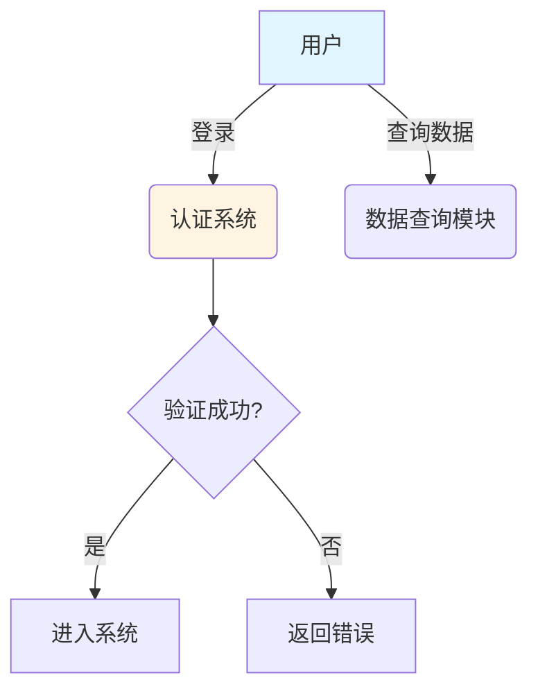
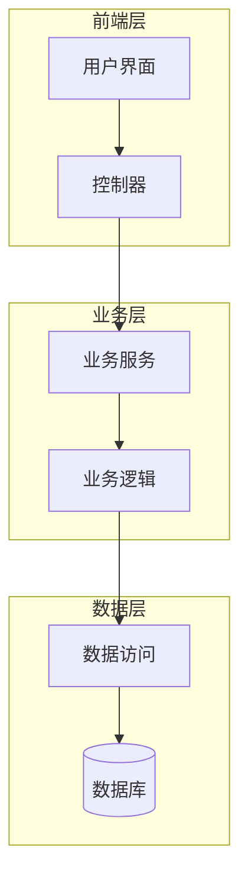
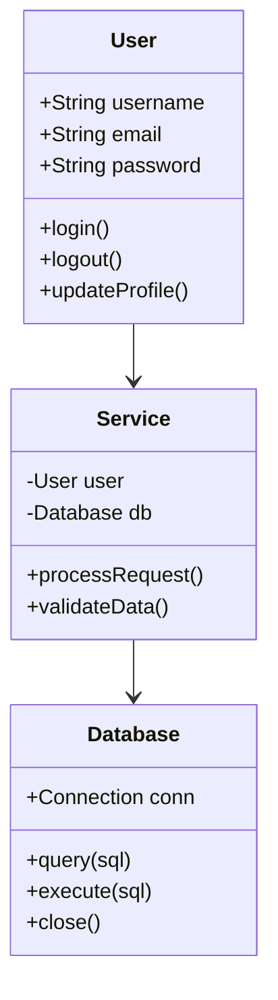
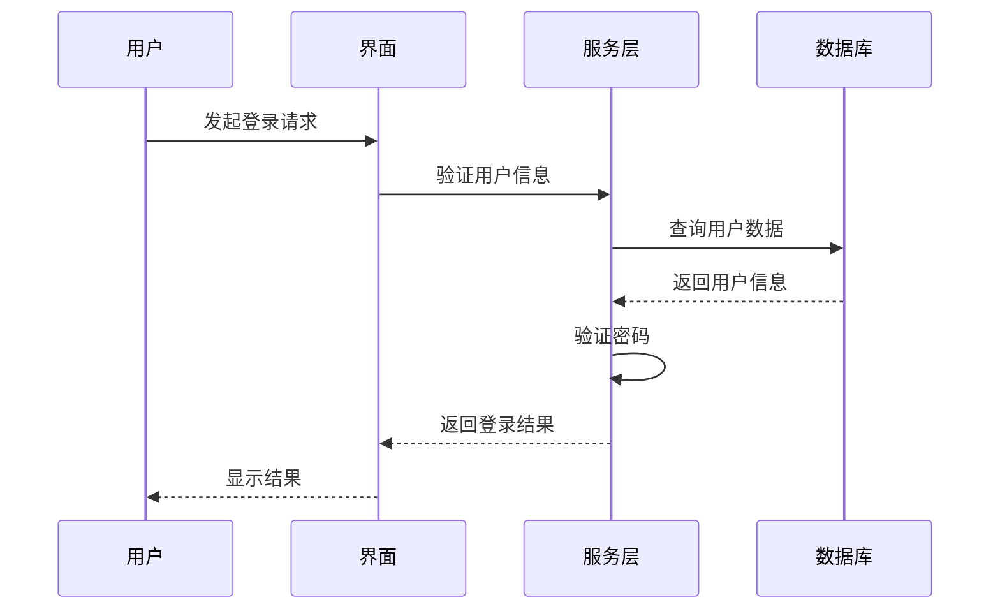
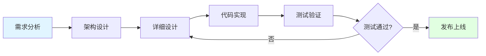

# UML图表驱动的代码生成系统

## 🎯 核心理念

传统的"自然语言→代码"直接生成存在重大缺陷：理解偏差大、缺少中间验证、难以追溯。

本系统采用**渐进式、可视化**的代码生成流程，通过UML图表作为中间表示，显著降低代码生成偏差。

## 📊 生成流程

```
传统方式（❌ 高偏差）:
需求描述 ──────> 代码实现
          ^
          |
    容易产生理解偏差

改进方式（✅ 低偏差）:
需求描述 
  → 用例图（Use Case）        [验证需求理解]
    → 组件图（Component）      [验证架构设计]
      → 类图（Class）          [验证接口设计]
        → 序列图（Sequence）   [验证交互流程]
          → 代码实现           [基于图表生成]

每一步都可验证和修正 ✓
```

## 🎨 支持的UML图表类型

### 1. 用例图（Use Case Diagram）
**适用模块**: 详细需求描述

**用途**: 
- 识别系统的参与者（Actor）
- 定义主要用例（Use Case）
- 理清用例之间的关系

**Mermaid语法示例**:


### 2. 组件图（Component Diagram）
**适用模块**: 架构设计

**用途**:
- 展示系统的主要组件
- 定义组件之间的依赖关系
- 规划系统的分层结构

**Mermaid语法示例**:


### 3. 类图（Class Diagram）
**适用模块**: 详细设计

**用途**:
- 定义类的结构（属性和方法）
- 展示类之间的关系
- 作为代码生成的直接依据

**Mermaid语法示例**:


### 4. 序列图（Sequence Diagram）
**适用模块**: 需求到详细设计的追溯

**用途**:
- 展示对象之间的交互顺序
- 定义方法调用流程
- 验证业务逻辑的正确性

**Mermaid语法示例**:


### 5. 流程图（Flowchart）
**适用模块**: 需求到架构的追溯

**用途**:
- 展示业务流程
- 定义决策点和分支
- 建立需求到实现的追溯链

**Mermaid语法示例**:


## 🚀 使用方法

### 方法1: 手动编辑图表

1. 点击模块顶部的**"用例图/组件图/类图"**标签
2. 在左侧编辑区输入Mermaid代码
3. 点击**"刷新预览"**查看图表
4. 调整代码直到满意
5. 基于图表进行下一步设计或代码生成

### 方法2: AI自动生成图表

1. 在**"文本描述"**标签中输入需求/设计内容
2. 点击**"生成用例图/组件图/类图"**按钮
3. 系统调用LLM自动生成Mermaid代码
4. 预览并手动调整图表
5. 验证图表正确性后进行下一步

### 方法3: 渐进式生成代码

```
完整流程示例:

1. 在"详细需求描述"中输入问题
   ↓
2. 点击"生成用例图"
   ↓
3. 验证用例图是否正确理解需求
   ↓
4. 在"架构设计"中基于用例图描述架构
   ↓
5. 点击"生成组件图"
   ↓
6. 验证组件划分是否合理
   ↓
7. 在"详细设计"中基于组件图设计接口
   ↓
8. 点击"生成类图"
   ↓
9. 验证类设计是否完整
   ↓
10. 点击"生成代码"（基于类图）
    ↓
11. 获得高质量、低偏差的代码！
```

## 💡 最佳实践

### 1. 逐步细化
不要一次性完成所有设计，而是逐步细化：
- 先用例图 → 明确功能边界
- 再组件图 → 确定模块划分
- 然后类图 → 设计接口细节
- 最后代码 → 实现具体逻辑

### 2. 验证一致性
每生成一个图表，都要验证：
- 是否与上一步的图表一致？
- 是否遗漏了重要的需求？
- 是否存在设计上的问题？

### 3. 专家评阅
结合AI生成和人工评审：
- LLM生成初版图表
- 专家评审和修正
- 保存修正后的版本
- 基于修正版本生成代码

### 4. 建立追溯链
在两个追溯模块中记录：
- 每个需求对应哪些架构组件
- 每个架构组件对应哪些类和方法
- 完整的需求→设计→代码链条

## 🔧 技术实现

### 前端
- **Mermaid.js**: 轻量级UML图表渲染库
- **实时预览**: 编辑代码后即时渲染
- **双面板设计**: 左侧编辑，右侧预览

### 后端
- **LLM图表生成**: 调用LLM API生成Mermaid代码
- **智能提取**: 自动从LLM响应中提取图表代码
- **多种图表支持**: 支持5种常见UML图表类型

### API端点
```
POST /api/v1/review/generate-diagram
```

**请求体**:
```json
{
  "content": "用户需求文本",
  "diagram_type": "usecase|component|class|sequence|flowchart",
  "module_id": "detailedRequirement"
}
```

**响应**:
```json
{
  "success": true,
  "diagram_code": "graph TD\n    A[User] --> B[System]\n    ..."
}
```

## 📈 效果对比

### 传统方式
```
需求: "实现一个用户登录功能"
      ↓ (直接生成)
代码: def login(username, password):
          # LLM可能产生的问题:
          # - 缺少密码加密
          # - 没有验证逻辑
          # - 缺少错误处理
          return True
```

### 图表驱动方式
```
需求: "实现一个用户登录功能"
      ↓
用例图: 明确参与者(用户、系统)和流程
      ↓
组件图: 设计认证服务、数据库访问层
      ↓
类图: 定义User类、AuthService类、Database类
      ↓
序列图: 定义login方法的调用流程
      ↓
代码: class AuthService:
          def __init__(self, db):
              self.db = db
          
          def login(self, username, password):
              # 基于图表生成的完整实现
              user = self.db.query_user(username)
              if not user:
                  raise AuthError("用户不存在")
              
              hashed = hash_password(password)
              if user.password != hashed:
                  raise AuthError("密码错误")
              
              return create_session(user)
```

**质量提升明显！**

## 🎓 学习资源

### Mermaid官方文档
- https://mermaid.js.org/
- 包含所有图表类型的详细语法

### 在线编辑器
- https://mermaid.live/
- 实时预览和调试Mermaid代码

### UML基础知识
- 用例图: https://www.uml.org/what-is-uml.htm
- 类图: https://www.visual-paradigm.com/guide/uml/
- 序列图: https://www.ibm.com/docs/en/sequence-diagrams

## 🚧 未来扩展

### 计划功能
1. **图表互转**: 用例图自动生成组件图
2. **代码生成**: 从类图直接生成代码骨架
3. **图表验证**: 检查图表一致性和完整性
4. **版本对比**: 对比不同版本的图表差异
5. **协作编辑**: 多人实时协作编辑图表

### 支持更多图表类型
- 状态图（State Diagram）
- 活动图（Activity Diagram）
- 部署图（Deployment Diagram）
- ER图（Entity-Relationship Diagram）

## 📞 问题反馈

如果在使用过程中遇到问题：
1. 检查Mermaid语法是否正确
2. 查看浏览器控制台的错误信息
3. 尝试使用默认模板
4. 联系技术支持

---

**版本**: 1.0.0  
**最后更新**: 2024-11-08  
**作者**: Professional Code Development Platform Team

