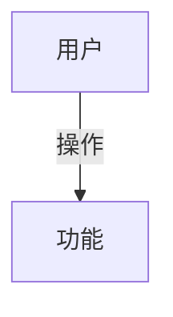
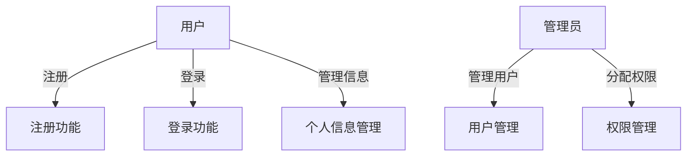
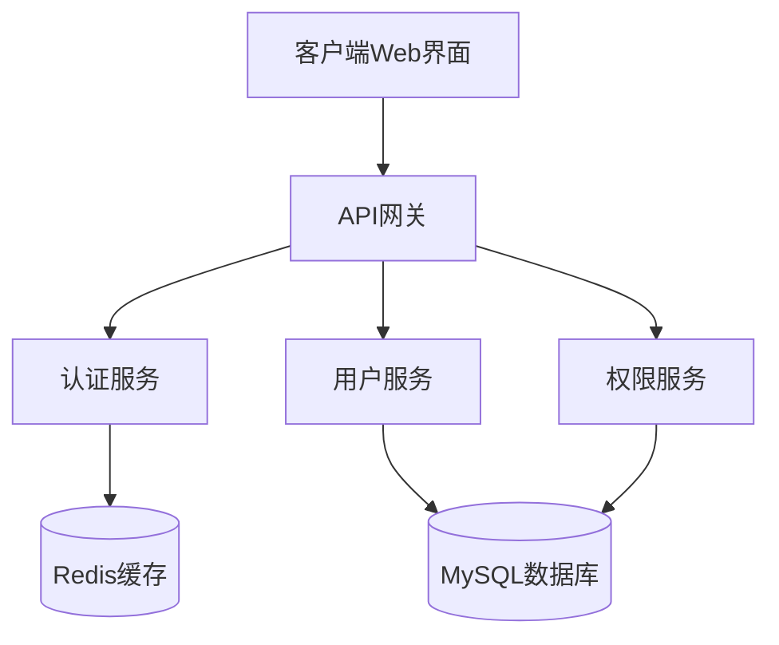
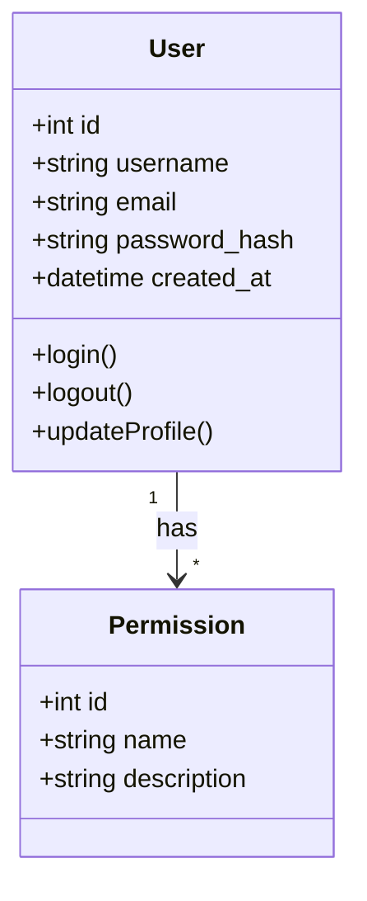

# ✅ 图表生成功能 - 实现完成报告

## 🎉 功能已全部实现！

现在LLM评阅会**自动生成Mermaid图表**，包括：
- 📊 用例图 (Use Case Diagram)
- 🏗️ 架构图 (Architecture Diagram)
- 📈 类图 (Class Diagram)
- 🔄 序列图 (Sequence Diagram)
- 🔗 追溯关系图 (Traceability Diagram)

---

## 📋 功能实现清单

### ✅ 后端修改（requirements.py）
**文件**: `backend/api/routes/requirements.py`

**修改内容**：
1. ✅ 修改5个章节的评阅提示词
2. ✅ 要求AI生成Markdown格式 + Mermaid图表代码
3. ✅ 优先选择有API Key的provider（已修复）

**示例提示词**：
```python
"detailed_requirement": """请对以下详细需求描述进行专业评阅，并生成用例图：

{content}

请按以下格式输出：

## 📋 需求评阅
1. 需求完整性：...
2. 需求清晰度：...

## 📊 用例图

"""
```

### ✅ 前端修改

#### 1. index.html - 添加Mermaid.js库
**文件**: `web/templates/index.html`（第643-657行）

```html
<!-- Mermaid.js - 用于渲染图表 -->
<script type="module">
  import mermaid from 'https://cdn.jsdelivr.net/npm/mermaid@10/dist/mermaid.esm.min.mjs';
  mermaid.initialize({
    startOnLoad: false,
    theme: 'default',
    securityLevel: 'loose'
  });
  window.mermaid = mermaid;
</script>
```

#### 2. requirements.js - 添加图表渲染功能
**文件**: `web/static/js/requirements.js`

**新增方法**：
- `convertMarkdownToHTML()` - 将Markdown转换为HTML
- `renderMermaidCharts()` - 渲染Mermaid图表

**关键代码**：
```javascript
// 渲染评阅结果时
reviewContent.innerHTML = this.convertMarkdownToHTML(result.llm_review);
await this.renderMermaidCharts(reviewContent);
```

---

## 🎨 每个章节生成的图表

| 章节类型 | 生成的图表 | Mermaid类型 |
|---------|----------|------------|
| 📄 详细需求描述 | 用例图 | `graph TD` |
| 🏗️ 架构设计 | 架构图 | `graph TB` |
| 💻 详细设计 | 类图 + 序列图 | `classDiagram` + `sequenceDiagram` |
| 🔗 需求→架构追溯 | 追溯关系图 | `graph LR` |
| 🔗 需求→详细设计追溯 | 追溯关系图 | `graph LR` |

---

## 🚀 使用方法

### 步骤1：启动服务
```bash
python start.py
```

### 步骤2：配置API Key（如果还没配置）
1. 访问 http://localhost:8080
2. 点击右上角"设置"图标
3. 配置deepseek的API Key（或其他provider）
4. 保存设置

### 步骤3：测试图表生成
1. 滚动到"Professional需求管理"区域
2. 在"详细需求描述"框中输入：
```
开发一个用户管理系统
- 用户可以注册和登录
- 管理员可以管理用户权限
- 支持用户信息的增删改查
```
3. 点击"🤖 LLMs评阅"按钮
4. 等待5-10秒
5. ✅ 查看生成的评阅报告和用例图！

---

## 📊 预期效果

点击LLM评阅后，会显示：

```
┌──────────────────────────────────────┐
│ 🤖 LLM评阅                            │
├──────────────────────────────────────┤
│                                       │
│ ## 📋 需求评阅                        │
│                                       │
│ 1. 需求完整性：✓ 已覆盖用户管理...   │
│ 2. 需求清晰度：✓ 描述清晰明确...     │
│ 3. 可测试性：✓ 可通过单元测试...     │
│ 4. 改进建议：建议添加密码加密...     │
│                                       │
│ ## 📊 用例图                          │
│                                       │
│ ┌────────────────────────┐           │
│ │                        │           │
│ │    用户                │           │
│ │     ↓                  │           │
│ │   注册/登录            │           │
│ │     ↓                  │           │
│ │  管理个人信息          │           │
│ │                        │           │
│ │    管理员              │           │
│ │     ↓                  │           │
│ │  管理用户权限          │           │
│ │                        │           │
│ └────────────────────────┘           │
│                                       │
│ 说明：用例图展示了系统的主要参与者... │
│                                       │
└──────────────────────────────────────┘
```

---

## 🔧 技术细节

### Markdown转HTML
```javascript
convertMarkdownToHTML(markdown) {
  // 1. 转换标题 (##, ###)
  // 2. 提取Mermaid代码块
  // 3. 转换其他代码块
  // 4. 转换粗体、列表等
  return html;
}
```

### Mermaid渲染
```javascript
renderMermaidCharts(container) {
  // 1. 查找所有 .mermaid-chart 元素
  // 2. 提取Mermaid代码
  // 3. 使用 mermaid.render() 生成SVG
  // 4. 替换原始代码为SVG图表
}
```

---

## 🐛 故障排除

### 问题1：图表不显示
**原因**：Mermaid.js未加载
**解决**：检查浏览器控制台是否有错误，强制刷新（Ctrl+F5）

### 问题2：AI没有生成Mermaid代码
**原因**：AI理解了提示词但没有按格式输出
**解决**：
- 重新点击"LLMs评阅"
- 或使用不同的provider（如claude更擅长生成图表）

### 问题3：图表渲染失败
**原因**：Mermaid语法错误
**解决**：查看控制台错误信息，图表区域会显示"图表渲染失败"提示

---

## 📝 示例输出

### 详细需求 - 用例图示例


### 架构设计 - 架构图示例


### 详细设计 - 类图示例


---

## 🎯 下一步优化建议

1. **图表编辑功能**：允许用户手动编辑Mermaid代码
2. **图表导出**：支持导出为PNG/SVG图片
3. **图表模板库**：预设常用图表模板
4. **实时预览**：编辑时实时预览图表

---

## ✅ 测试检查清单

- [ ] 后端API返回包含Mermaid代码的评阅
- [ ] 前端正确解析Markdown格式
- [ ] Mermaid图表正确渲染为SVG
- [ ] 5个章节都能生成对应的图表
- [ ] 图表样式美观，适配页面
- [ ] 图表在下载文档时包含在内

---

## 📚 相关文档

- Mermaid官方文档: https://mermaid.js.org/
- Mermaid在线编辑器: https://mermaid.live/
- 需求管理模块完整文档: `docs/需求管理模块_完整实现文档.md`

---

**版本**: v2.0 (with Chart Support)
**更新时间**: 2024-12-06
**状态**: ✅ 已完成并可用

🎉 **所有功能已实现，现在可以开始测试了！**
