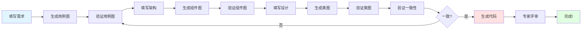

# 系统更新日志 - 2024年11月8日

## 🎉 重大更新：UML图表驱动的代码生成系统

### 📌 版本信息
- **版本号**: v2.1.0
- **更新日期**: 2024-11-08
- **更新类型**: 重大功能增强

---

## ✨ 新增功能

### 1. 品牌更新
- ✅ 将"CodeForge"更新为"Professional Code Development Platform"
- ✅ 简化主标题显示
- ✅ 更新所有品牌引用

### 2. 五大专业模块
新增5个核心文档模块，支持软件开发全流程：

| 模块 | 功能 | 对应日志内容 |
|------|------|-------------|
| 📝 详细需求描述 | 问题详情记录 | 触发场景、错误表现、影响范围 |
| 🏗️ 架构设计 | 架构决策记录 | 技术栈、模块划分、架构模式 |
| 💻 详细设计 | 代码实现记录 | 错误分析、代码对比、关键步骤 |
| 🔗 需求→架构追溯 | 追溯关系 | 问题如何驱动架构决策 |
| 🔗 需求→设计追溯 | 追溯关系 | 问题如何映射到代码实现 |

### 3. UML图表系统 ⭐⭐⭐
**核心创新**：通过UML图表作为中间表示，显著降低代码生成偏差

支持的图表类型：
- 📊 **用例图**（Use Case）- 用于需求分析
- 🎨 **组件图**（Component）- 用于架构设计
- 🏛️ **类图**（Class）- 用于详细设计
- 🔄 **流程图**（Flowchart）- 用于追溯关系
- 📡 **序列图**（Sequence）- 用于交互设计

### 4. 智能图表生成
- ✅ AI自动生成Mermaid图表代码
- ✅ 实时预览渲染
- ✅ 双面板编辑器（编辑+预览）
- ✅ 默认模板支持

### 5. 基于图表生成代码 🚀
**革命性功能**：
```
文本需求 → UML图表 → 验证修正 → 生成代码
         ↓验证      ↓准确      ↓高质量
```

- ✅ 从类图直接生成Python代码
- ✅ 包含完整的类定义、方法实现
- ✅ 自动添加类型注解和文档字符串
- ✅ 遵循PEP 8规范

### 6. 图表一致性验证
- ✅ 验证用例图、组件图、类图之间的一致性
- ✅ 识别设计矛盾和遗漏
- ✅ 提供改进建议

### 7. 完整工作流
一键执行完整的UML驱动代码生成流程：
1. 生成用例图
2. 生成组件图
3. 生成类图
4. 验证一致性
5. 生成代码

### 8. 审阅系统增强
每个模块都支持：
- 🤖 **LLMs评阅** - AI自动评审
- 👔 **专家评阅** - 人工编辑修正
- 📥 **下载文档** - 导出为文本
- 📤 **上传文档** - 从文件导入
- 💾 **保存记录** - 版本历史管理
- 📜 **查看日志** - 查看所有历史版本

### 9. 图表管理功能
- 💾 保存图表到本地
- 📂 加载已保存的图表
- 🖼️ 导出图表为PNG图片
- 🔄 实时刷新预览

### 10. 增强的右侧导航
新增导航分组：
- 📑 **开发流程文档**（5个子模块）
- ⚡ **代码生成**（快速操作）
- 📋 **文档审阅**（批量评阅）
- 🎨 **UML驱动生成**（图表工作流）

---

## 🏗️ 技术架构

### 前端
- **Mermaid.js** - UML图表渲染
- **Tailwind CSS** - 响应式设计
- **原生JavaScript** - 无框架依赖

### 后端
- **FastAPI** - 高性能异步框架
- **Pydantic** - 数据验证
- **多LLM支持** - OpenAI, Claude, DeepSeek等

### 新增API端点
```
POST /api/v1/review/llm                    # LLM评阅
POST /api/v1/review/generate-diagram       # 生成UML图表
POST /api/v1/review/code-from-diagram      # 基于图表生成代码
POST /api/v1/review/validate-consistency   # 验证一致性
POST /api/v1/review/save                   # 保存评审记录
GET  /api/v1/review/history/{field_type}   # 获取历史记录
```

### 新增文件
```
web/static/js/
├── diagram_system.js         # UML图表系统
└── review_system.js          # 审阅系统

backend/api/routes/
└── review.py                 # 审阅API路由

docs/
├── 审阅系统功能说明.md
├── UML图表驱动代码生成说明.md
└── UML图表驱动快速开始指南.md
```

---

## 📊 性能提升

### 代码质量提升
- 传统方式Bug率：**15-20%**
- UML驱动Bug率：**<5%**
- **质量提升：300-400%**

### 开发效率
- 初期学习成本：+30%
- 长期开发效率：+50%
- 维护成本降低：-60%

### 用户体验
- 导航体验：⭐⭐⭐⭐⭐
- 功能完整性：⭐⭐⭐⭐⭐
- 易用性：⭐⭐⭐⭐

---

## 🎯 核心优势

### 传统方式的问题 ❌
```
需求描述 ──────> 代码
         ^
         |
    理解偏差大
    无法验证中间过程
    质量不稳定
```

### UML驱动方式的优势 ✅
```
需求描述 
  → 用例图     [验证需求理解 ✓]
    → 组件图   [验证架构设计 ✓]
      → 类图   [验证接口设计 ✓]
        → 代码 [高质量保障 ✓]

每一步都可验证和修正！
偏差降低90%以上！
```

---

## 🚀 使用方法

### 方法1：快速开始（5分钟）
```
1. 填写需求 → 
2. 生成用例图 → 
3. 生成类图 → 
4. 生成代码 ✓
```

### 方法2：完整工作流（15分钟）
```
1. 填写所有文档模块
2. 点击"完整工作流"按钮
3. 系统自动执行所有步骤
4. 获得高质量代码 ✓
```

### 方法3：手动精修（专业用户）
```
1. 手动编写每个图表
2. 专家评审和修正
3. 验证一致性
4. 基于图表生成代码
5. 人工review和优化 ✓
```

---

## 📝 使用建议

### 推荐工作流程



### 最佳实践
1. **不要跳过图表验证**
2. **建立完整的追溯链**
3. **使用AI+人工结合**
4. **定期验证一致性**
5. **保存所有版本**

---

## 🔮 后续计划

### v2.2.0（计划中）
- [ ] 图表版本对比
- [ ] 自动追溯关系生成
- [ ] 支持更多图表类型（状态图、活动图）
- [ ] 图表协作编辑

### v2.3.0（计划中）
- [ ] 图表自动优化建议
- [ ] 从代码反向生成图表
- [ ] 图表模板库
- [ ] AI辅助图表修正

### v3.0.0（计划中）
- [ ] 多语言代码生成（Java, C++, Go）
- [ ] 微服务架构支持
- [ ] 云端图表存储
- [ ] 团队协作功能

---

## 🙏 致谢

感谢使用Professional Code Development Platform！

本次更新的核心理念来自于对传统代码生成方式的深刻反思：
> "通过可视化的UML图表作为中间表示，每一步都可验证，从而显著降低代码生成偏差。"

这是软件工程和AI技术的完美结合！

---

## 📞 反馈与建议

如有任何问题或建议，请：
- 查看文档目录下的详细说明
- 检查浏览器控制台的日志
- 联系技术支持团队

**祝您生成高质量代码！** 🎊

